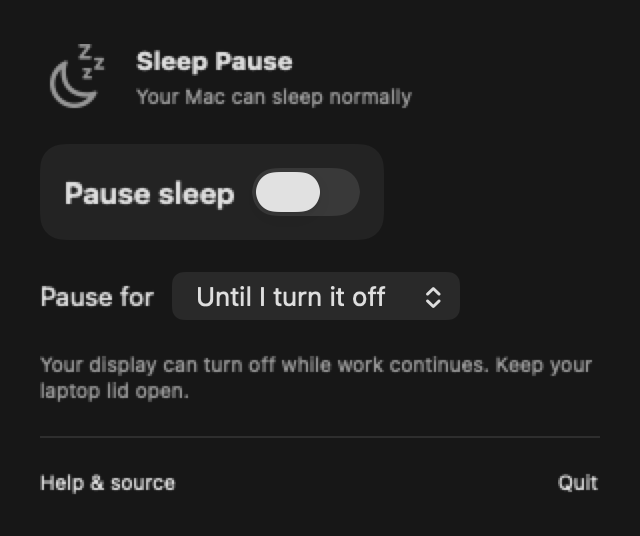
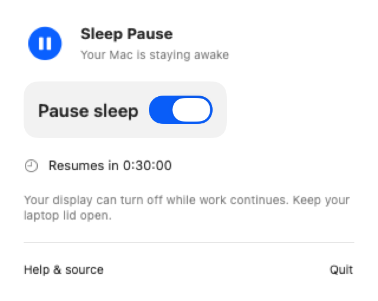

# Sleep Pause

Keep your Mac awake while agents, builds, downloads, or other work run. Click the moon in your menu bar and turn on **Pause sleep**. Turn it off to let macOS sleep normally again.

A small native SwiftUI app for macOS 13 Ventura or later, on Apple Silicon and Intel. No Dock icon, account, network requests, analytics, or dependencies.

 

Panels rendered from the app's SwiftUI views.

## Use it

1. Move **Sleep Pause.app** into Applications and open it.
2. Click the moon in the menu bar.
3. Choose a duration, then turn on **Pause sleep**.
4. Turn the switch off when finished, or let the timer expire.

The menu bar icon becomes a filled pause symbol while active. You can pause indefinitely or for 30 minutes, 1, 2, 4, or 8 hours. Quit also ends the session. Each launch starts with normal sleep enabled; only your preferred duration is saved.

Your screen can turn off and your Mac can lock while work continues. Keep a laptop's lid open. This app prevents **idle system sleep**; it does not override closing the lid, manually choosing Sleep, shutdown, low-battery protection, or thermal protection. Turning the switch off restores normal sleep eligibility rather than forcing immediate sleep. Other apps may still prevent sleep.

To launch at login, add Sleep Pause in macOS System Settings under General → Login Items. It will still start with sleep prevention off.

## Build locally

Install Apple's Command Line Tools, or Xcode, with Swift 5.9 or later. Then run:

```sh
git clone https://github.com/LiteEagle262/macos-Sleep-Pausing-App.git
cd macos-Sleep-Pausing-App
./scripts/test.sh
./scripts/build-app.sh
open "dist/Sleep Pause.app"
```

The build script creates a universal app for arm64 and x86_64, generates its icon, and applies an ad hoc signature for local use. Full Xcode is not required to build. With Xcode installed, `swift test` also runs the XCTest suite.

**Release status:** the source and local build are available. An Apple-signed, notarized public release has not been produced yet. Locally signed builds are for development, not the public distribution channel.

## How it works

The app holds one `PreventUserIdleSystemSleep` assertion through [Apple's IOKit power management API](https://developer.apple.com/documentation/iokit/1557134-iopmassertioncreatewithname). It releases the assertion when you turn the switch off, a timer expires, or the app exits. macOS also removes process-owned assertions if the process crashes or is killed. No `sudo`, helper daemon, or persistent power settings are involved.

Timer deadlines use wall-clock time and are checked after wake. Manually changing the system clock can change a timed session's remaining duration.

To inspect the active assertion:

```sh
pmset -g assertions
```

Look for `Sleep Pause: keeping work running` under the app's process. The interface uses Apple's [MenuBarExtra](https://developer.apple.com/documentation/swiftui/menubarextra).

## Development and releases

- [Release instructions](docs/RELEASING.md), including signing and notarization
- [Test checklist](docs/TESTING.md)
- [Contributing](CONTRIBUTING.md)
- [Security policy](SECURITY.md)
- [Changelog](CHANGELOG.md)

Licensed under the [MIT License](LICENSE).
